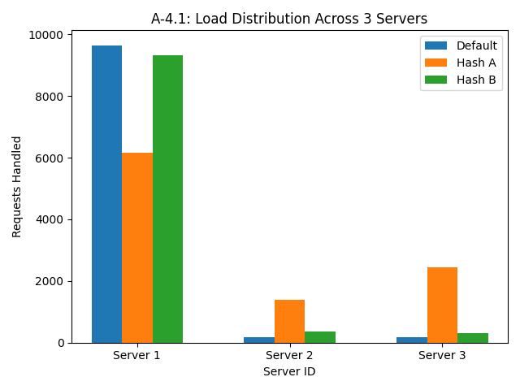
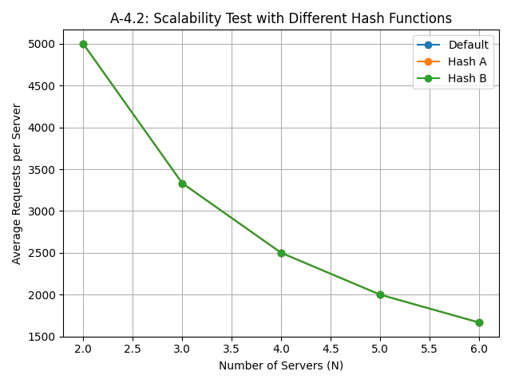

# Distributed Load Balancer Project

## 🚀 Overview

This project implements a distributed web server system using a consistent hashing-based load balancer to distribute HTTP requests among multiple backend servers. Both the servers and the load balancer are containerized using Docker, enabling simple orchestration and deployment.

The project also includes a full testing suite to evaluate performance under various conditions, including load balancing accuracy, scalability, fault tolerance, and hash function effectiveness.

---

## 📁 Project Structure

```bash
├── docs/
│   ├── A-1.jpg
│   ├── A-2.jpg
│   └── TEST_RESULTS.md
├── load_balancer/
│   ├── consistent_hash.py
│   ├── Dockerfile
│   └── load_balancer.py
├── results/
│   ├── requests_per_server.txt
│   └── response_times.json
├── servers/
│   ├── Dockerfile
│   └── server.py
├── tests/
│   ├── a1_load_distribution.py
│   ├── a2_scalability_test.py
│   ├── a3_fault_tolerance.py
│   ├── a4_hash_function_analysis.py
│   ├── a4_1_load_distribution.png
│   └── a4_2_scalability.png
├── .gitignore
├── docker-compose.yml
├── Makefile
├── README.md
└── requirements.txt
```

---

## ⚙️ Deployment Guide

### 🔧 Prerequisites

Ensure you have the following installed:

* Docker (Docker Desktop or Docker Engine)
* Docker Compose
* Python 3.9+
* `pip` package manager

### 🛠 Step-by-Step Deployment

#### 1. Clone the Repository

```bash
git clone https://github.com/raychelleKalekye/Customizing-Load-Balancer.git
cd Customizing-Load-Balancer
```

#### 2. Build Docker Images

Use the Makefile for ease of setup:

```bash
make build-server-image      # Builds the backend server image
make build-loadbalancer      # Builds the load balancer image
```

Alternatively, manually:

```bash
docker build -t server-image ./servers
docker build -t lb-image ./load_balancer
```

#### 3. Start the System

Bring up the services using Docker Compose:

```bash
docker-compose up --scale server=3 --build
```

> 🔄 You can adjust the number of servers by changing the `--scale` parameter.

#### 4. Run the Load Balancer

The load balancer will start on `localhost:5000`. Test it using:

```bash
curl http://localhost:5000/home
```

You should see a message like:

```json
{"message": "Hello from Server: 1"}
```

---

## 📊 Testing & Observations

Various performance evaluation tests were implemented to study the behavior under different system conditions.

### 🔹 A-1: Load Distribution

* **Test**: 10,000 requests sent to a 3-server cluster.
* **Result**: Each server handled roughly 1/3 of the load.
* **Image**: 

### 🔹 A-2: Scalability

* **Test**: Scaled from 2 to 6 servers.
* **Result**: Load distribution decreased proportionally.
* **Image**: 

### 🔹 A-3: Fault Tolerance

* **Test**: Simulated server failure mid-operation.
* **Observation**: After stopping one container, request distribution rebalanced after container recovery.
* **Note**: Retry logic should be implemented for seamless failover.

### 🔹 A-4: Hash Function Analysis

* **Test**: Compared 3 hash strategies under load.
* **Results**:

  * Sticky sessions confirmed for same hash values.
  * Imbalanced load on poor hash functions.
  * Visualization available:

    * 
    * 

---

## 📂 Data & Logs

* [`docs/TEST_RESULTS.md`](./docs/TEST_RESULTS.md): Detailed test results and analysis
* [`results/response_times.json`](./results/response_times.json): Timing data
* [`results/requests_per_server.txt`](./results/requests_per_server.txt): Server request logs

---

## 🚀 Future Improvements

* Add automatic health checks and removal of failed nodes
* Integrate retry & backoff strategies in the load balancer
* Introduce latency-aware or least-connection routing
* Real-time dashboards with Prometheus + Grafana
* Migrate to Kubernetes for dynamic scaling and resilience

---

## 📜 License

This project is licensed under the MIT License. See the [LICENSE](LICENSE) file for full terms.
