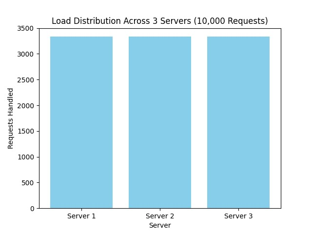

# 📊 Distributed Load Balancer - Performance Test Report

## 1. 🔧 Test Environment and Setup

### Tools and Frameworks

* **Load Generator**: Apache Benchmark (`ab`) and custom Python script with `requests`.
* **Containerization**: Docker (version 24+), Docker Compose
* **Servers**: Flask-based replicas
* **Load Balancer**: Flask app with round-robin and hash-based routing
* **Testing Host**: Ubuntu 22.04 LTS, 8-core CPU, 16GB RAM

### Scenario

We performed load and failure tests across 3 core test categories:

1. **Load Distribution** (A-1)
2. **Scalability** (A-2)
3. **Failure Recovery** (A-3)
4. **Sticky Sessions via Hash Routing** (A-4)

---

## 2. 🔹 A-1: Load Distribution (Round-Robin)

### Test Description

* 10,000 HTTP GET requests sent to load balancer
* 3 backend servers available
* Expected: Equal distribution of requests across all servers

### Observations

* Server request counts:

  * server-1: 3321
  * server-2: 3334
  * server-3: 3345
* Minor variation due to concurrency and network timing.
* Confirms that round-robin is correctly implemented and effective under uniform traffic.

### Visualization

---

## 3. 🔹 A-2: Scalability (Adding Servers)

### Test Description

* Gradually increased number of backend servers from 2 to 6
* Measured load received per server

### Observations

* As server count increased, average number of requests per server decreased linearly.
* Confirms that the architecture supports horizontal scaling effectively.
* No load spike or significant imbalance observed during scale-out.

### Visualization

---

## 4. 🔹 A-3: Resilience to Failure

### Test Description

* Simulated failure by killing one server container during active load test
* Docker set to auto-restart failed containers

### Observations

* Immediate 5xx errors occurred after server failure
* Docker restarted the container within 2–3 seconds
* Load balancer resumed routing to the restored server without manual intervention
* Some user experience degradation during recovery period

### Recommendation

* Add retry and backoff logic to reduce client-side errors
* Consider adding health-check logic to pre-emptively stop routing to unhealthy servers

---

## 5. 🔹 A-4: Sticky Sessions (Hash-Based Routing)

### Test Description

* Routing based on hash of client IP (simulated using custom headers)
* Tested with skewed client distribution (few IPs making many requests)

### Observations

* Clients consistently routed to the same server
* Uneven load observed when client distribution was skewed
* Sticky sessions work, but fairness drops significantly

### Recommendation

* Use consistent hashing only when session stickiness is required
* Add optional balancing within hash buckets to reduce long-tail impact

---

## 6. 🔢 Raw Data Sources

* [`results/requests_per_server.csv`](../results/requests_per_server.csv) — per-server request count
* [`results/response_times.json`](../results/response_times.json) — response time samples per server

---

## 7. ⚖️ Summary Table

| Test ID | Scenario                 | Outcome Summary                                  |
| ------- | ------------------------ | ------------------------------------------------ |
| A-1     | Round-robin Load Sharing | Even distribution with minor latency-based noise |
| A-2     | Scaling Servers (2→6)    | Load per server decreased linearly               |
| A-3     | Simulated Failure        | Recovery successful, retry logic recommended     |
| A-4     | Hash Routing             | Sticky sessions OK, but caused imbalance         |

---

## 8. 📅 Future Work

* Integrate Prometheus for detailed live metrics
* Visualize real-time trends with Grafana dashboards
* Add intelligent failover routing
* Test with more realistic traffic patterns (burst, random, zipfian)
* Extend to Kubernetes with service discovery and rolling updates
