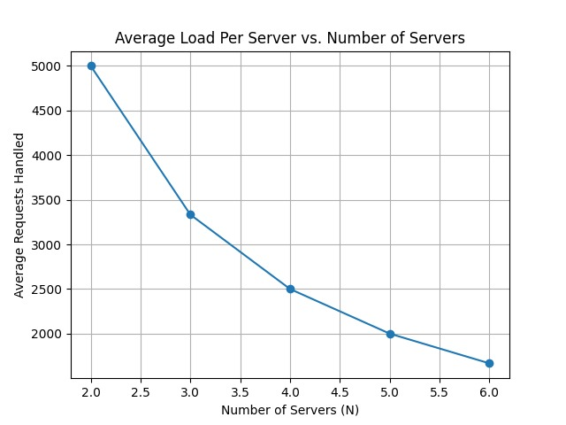

# TEST\_RESULTS.md

## 📘 Overview

This document contains the results and execution guidelines for a series of tests conducted on a consistent hashing-based load balancer implemented for a distributed system. Each test focuses on a different aspect of the system, such as load distribution, scalability, fault tolerance, and the effects of various hash functions. The objective is to analyze the system's behavior under simulated production-like conditions and evaluate its performance and robustness.

---

## 🧪 Test A-1: Load Distribution Across 3 Servers

* **Script**: `a1_load_distribution.py`
* **Purpose**: To evaluate how evenly the load balancer distributes incoming HTTP requests across three backend servers under normal operation.
* **Setup**: Simulates 10,000 concurrent requests using asynchronous execution with a cap of 100 concurrent tasks at any given time.
* **Expected Behavior**: Requests should be approximately evenly distributed among the three servers.
* **Result Image**:


* **Observation**: If the distribution is significantly skewed, it may point to inefficiencies or imbalance in the hashing algorithm or backend availability.

---

## 🧪 Test A-2: Scalability With Increasing Backend Servers

* **Script**: `a2_scalability_test.py`
* **Purpose**: To evaluate how well the load balancer scales when the number of available backend servers is increased from 2 to 6.
* **Setup**: Repeats the same 10,000-request workload for each server count (`N=2` to `N=6`), pausing slightly between tests to simulate real-world deployments.
* **Expected Behavior**: As more servers are added, the load should be balanced proportionally across all available servers.
* **Result Image**:



* **Observation**: Look for consistent distribution and whether any server is disproportionately loaded, which may suggest hash collision issues or improper ring resizing.

---

## 🧪 Test A-3: Fault Tolerance Test (Manual Intervention Required)

* **Script**: `a3_failt_tolerance.py`
* **Purpose**: To simulate a real-world fault scenario where one of the servers (e.g., `server2`) becomes unavailable, and observe whether the system reroutes traffic accordingly.
* **Setup**:

  1. Sends 1,000 requests and prints distribution.
  2. User is instructed to stop one container (e.g., `docker stop server2`).
  3. Sends another 1,000 requests and prints new distribution.
* **Expected Behavior**: The failed server should receive 0 requests after failure, and its share should be redistributed among the remaining servers.
* **Observation**: If requests continue to be routed to the failed server, it may indicate a lack of active health checks or improper cache invalidation.

> *Note: This test does not generate a graphical output.*

---

## 🧪 Test A-4: Hash Function Analysis

### A-4.1: Load Distribution Using Different Hash Functions

* **Script**: `a4_hash_function_analysis.py` (function: `run_a41()`)
* **Purpose**: To compare how three different hash functions affect load balancing across 3 servers.
* **Hash Variants**:

  * `Default`: Modular arithmetic
  * `Hash A`: Multiplicative method
  * `Hash B`: Bit-shift and XOR logic
* **Expected Behavior**: Ideal hash functions will distribute requests as evenly as possible.
* **Result Image**:


* **Observation**: Disparities in the bar chart can indicate weaknesses in the uniformity of a hash function.

### A-4.2: Scalability of Different Hash Functions

* **Script**: `a4_hash_function_analysis.py` (function: `run_a42()`)
* **Purpose**: To measure the average number of requests handled per server as the number of servers (`N`) increases from 2 to 6, using each hash function.
* **Result Image**:


* **Observation**: The flattest, most stable trendline across all `N` values indicates the most reliable hash function for dynamic scaling.

---

## ▶️ How to Run the Tests

### 1. Prerequisites

* Docker must be installed and running.
* Backend server containers (e.g., `server1`, `server2`, ...) should be accessible via Docker network.
* Python 3.8+ environment is recommended.
* Install required Python packages:

```bash
pip install aiohttp matplotlib numpy
```

### 2. Startup Instructions

Start your Docker setup with backend services and load balancer. Example:

```bash
docker-compose up --build
```

Ensure each backend server returns a JSON payload like:

```json
{"message": "Hello from Server: X"}
```

### 3. Executing Tests

Each of the following scripts should be executed one at a time from the terminal:

#### A-1: Load Distribution

```bash
python a1_load_distribution.py
```

#### A-2: Scalability Test

```bash
python a2_scalability_test.py
```

#### A-3: Fault Tolerance Test

```bash
python a3_failt_tolerance.py
```

* *User intervention required: Stop one of the running server containers when prompted.*

#### A-4: Hash Function Analysis

```bash
python a4_hash_function_analysis.py
```

* *Generates and saves two plots: `a4_1_load_distribution.png` and `a4_2_scalability.png`.*

---

## 📝 Conclusion

These tests provide a thorough evaluation of the implemented load balancer’s ability to:

* Distribute load effectively
* Scale with additional resources
* Handle failures gracefully
* Optimize load distribution through different hash strategies

For long-term robustness and scaling, continuous refinement of the hashing logic and active health checking are recommended.
